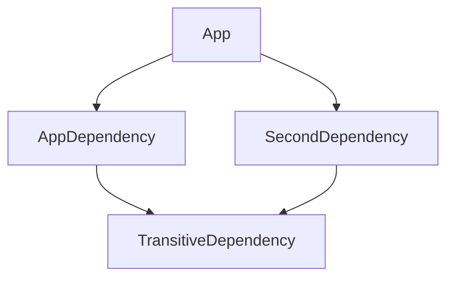
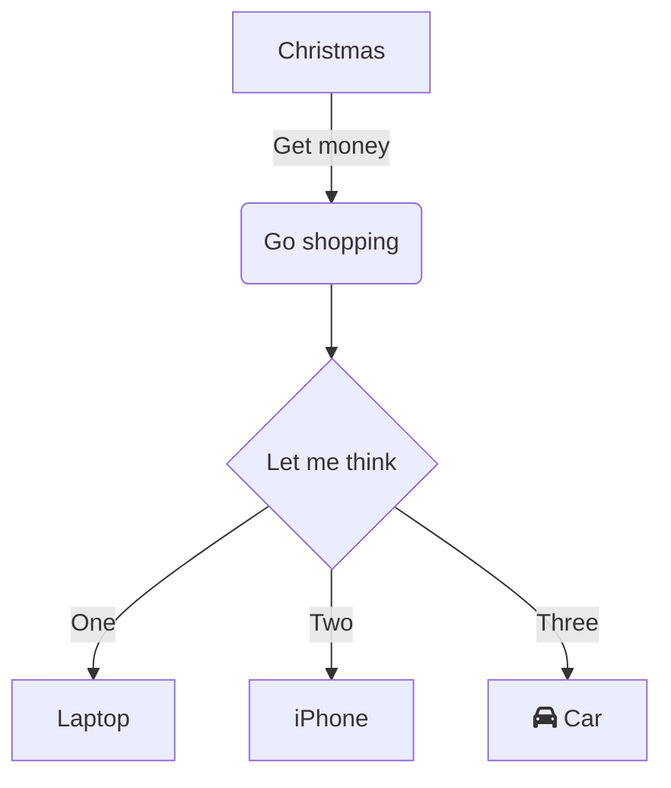
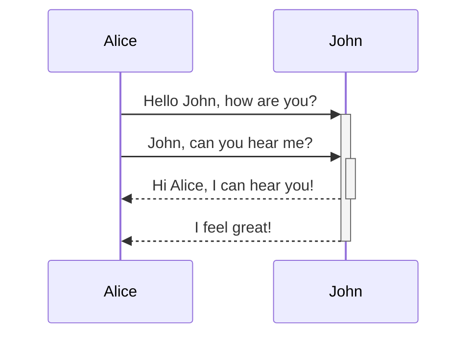
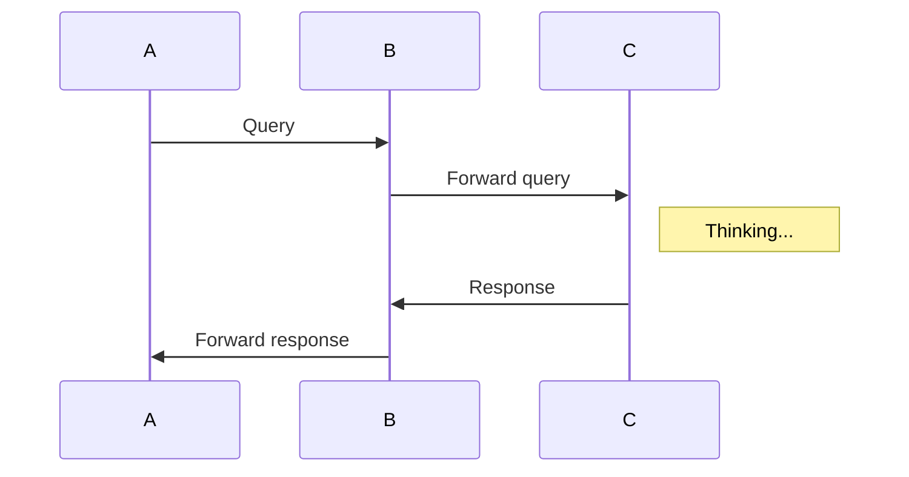
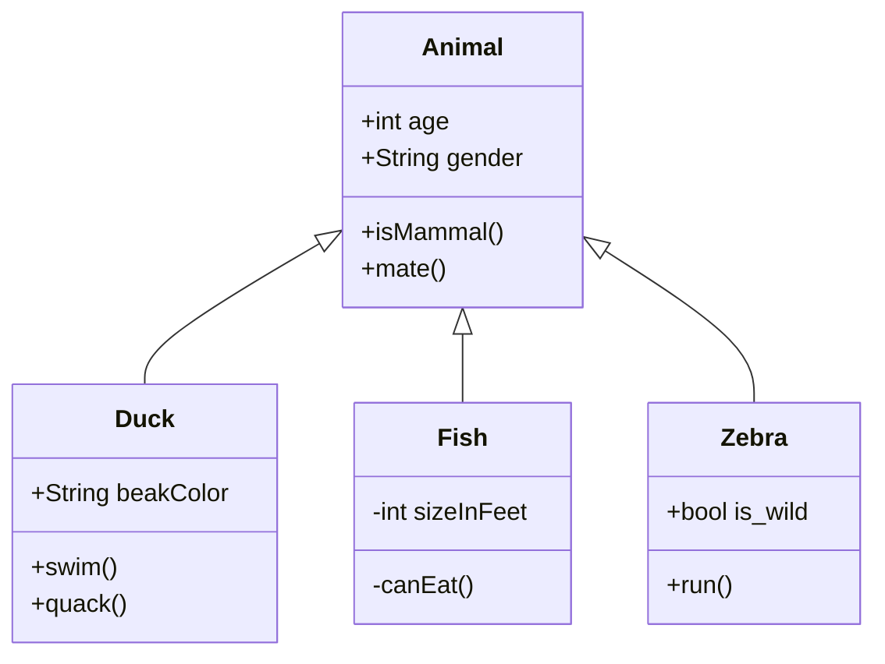
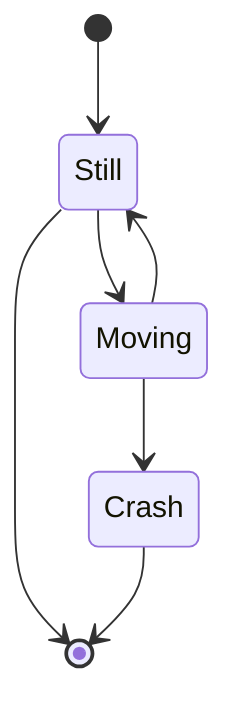
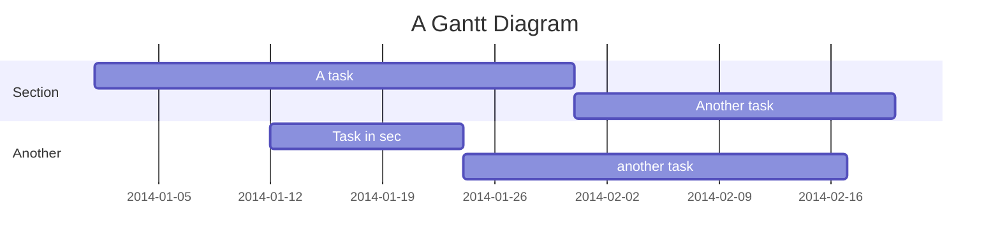
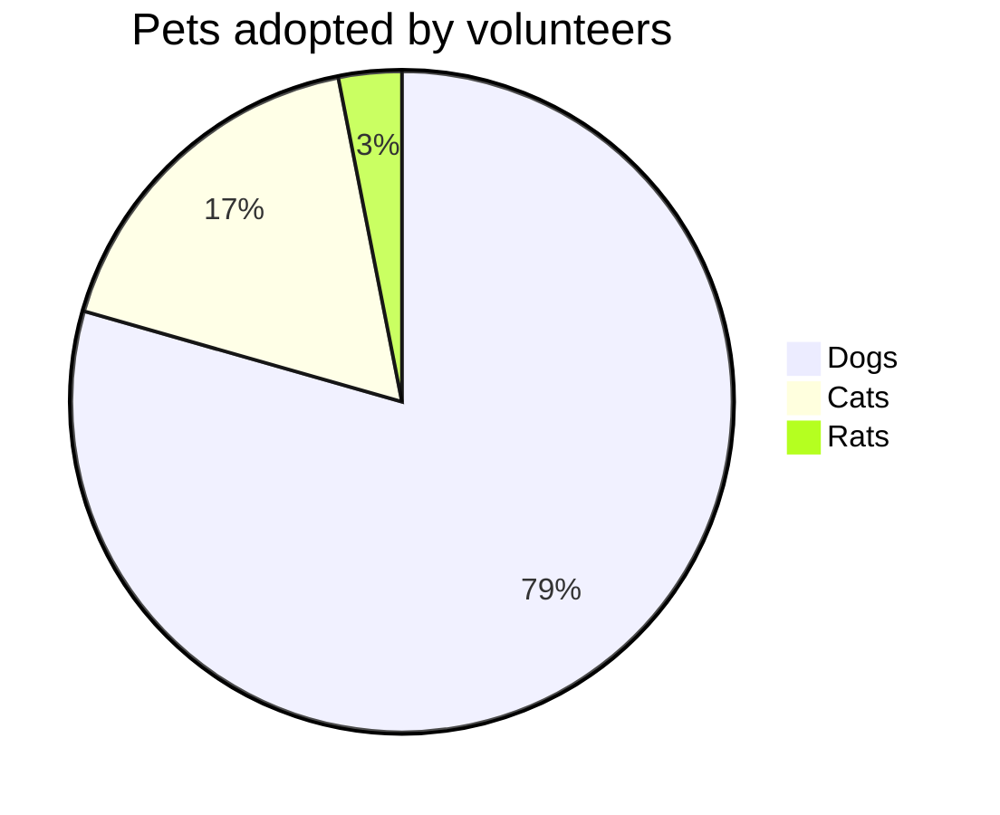
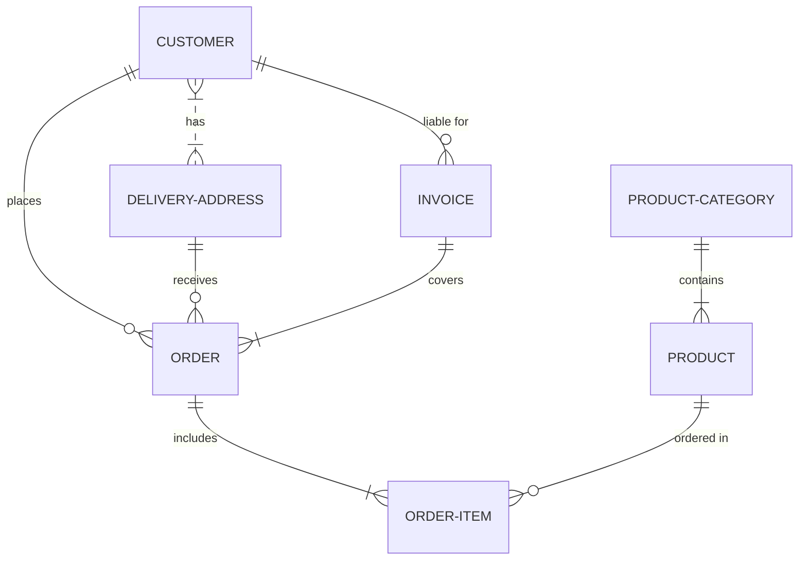

#Diagrams
For diagrams we use Mermaid.
Unfortenatly, unlike GitLab, GitHub (Pages) does not support this syntax, that is why if someone would like to view these 

If you see a top down transitive dependecy graph just below this statement, your setup is correct.



This graph has been generated using the following code and it is called top down graphs.

```code
'''mermaid
graph TD;
    App-->AppDependency;
    App-->SecondDependency;
    AppDependency-->TransitiveDependency;
    SecondDependency-->TransitiveDependency;
'''
```

Other graph types we can use with the current setup are the following
## Flowchart


## Sequence Diagram


another try


## Class Diagram



## State Diagram


## Ghant Chart


## Pie Chart :pie: 3.14


## ER diagrham

